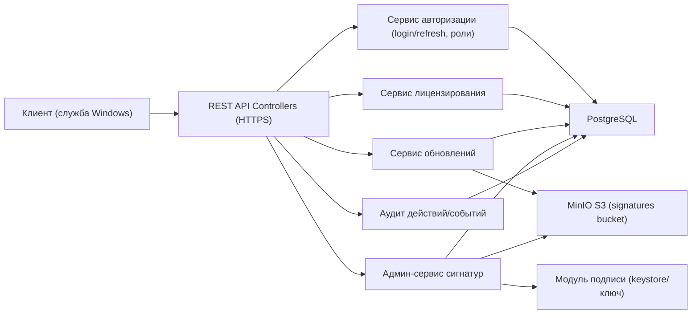
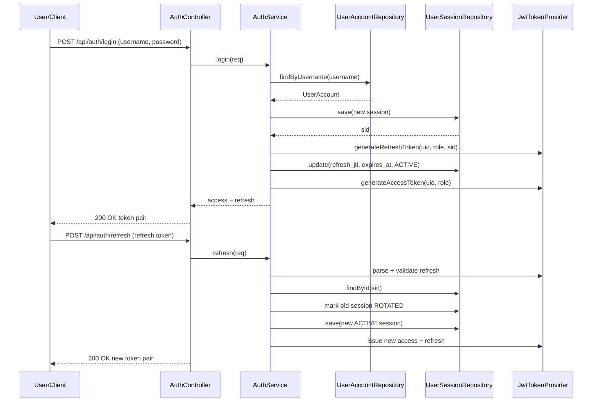
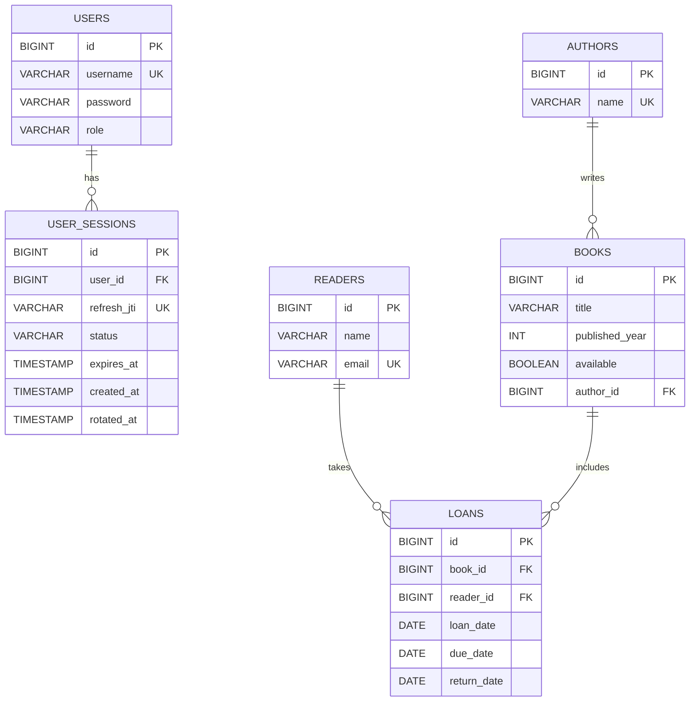

# Диаграммы проекта (на основе схемы преподавателя)

## UML Component (логические модули)

```mermaid
flowchart LR
    Client["Клиент (служба Windows)"] --> Api["REST API Controllers (HTTPS)"]
    Api --> Auth["Сервис авторизации (login/refresh, роли)"]
    Api --> License["Сервис лицензирования"]
    Api --> Updates["Сервис обновлений"]
    Api --> SignAdmin["Админ-сервис сигнатур"]
    Api --> Audit["Аудит действий/событий"]
    SignAdmin --> SignModule["Модуль подписи (keystore/ключ)"]
    Updates --> S3["MinIO S3 (signatures bucket)"]
    SignAdmin --> S3
    Auth --> DB["PostgreSQL"]
    License --> DB
    Updates --> DB
    SignAdmin --> DB
    Audit --> DB
```

## UML Sequence: login + refresh

```mermaid
sequenceDiagram
    participant U as User/Client
    participant A as AuthController
    participant S as AuthService
    participant R as UserAccountRepository
    participant US as UserSessionRepository
    participant J as JwtTokenProvider

    U->>A: POST /api/auth/login (username, password)
    A->>S: login(req)
    S->>R: findByUsername(username)
    R-->>S: UserAccount
    S->>US: save(new session)
    US-->>S: sid
    S->>J: generateRefreshToken(uid, role, sid)
    S->>US: update(refresh_jti, expires_at, ACTIVE)
    S->>J: generateAccessToken(uid, role)
    S-->>A: access + refresh
    A-->>U: 200 OK token pair

    U->>A: POST /api/auth/refresh (refresh token)
    A->>S: refresh(req)
    S->>J: parse + validate refresh
    S->>US: findById(sid)
    S->>US: mark old session ROTATED
    S->>US: save(new ACTIVE session)
    S->>J: issue new access + refresh
    A-->>U: 200 OK new token pair
```

## ER-диаграмма (основные таблицы)

```mermaid
erDiagram
    USERS ||--o{ USER_SESSIONS : has
    AUTHORS ||--o{ BOOKS : writes
    READERS ||--o{ LOANS : takes
    BOOKS ||--o{ LOANS : includes

    USERS {
      BIGINT id PK
      VARCHAR username UK
      VARCHAR password
      VARCHAR role
    }

    USER_SESSIONS {
      BIGINT id PK
      BIGINT user_id FK
      VARCHAR refresh_jti UK
      VARCHAR status
      TIMESTAMP expires_at
      TIMESTAMP created_at
      TIMESTAMP rotated_at
    }

    AUTHORS {
      BIGINT id PK
      VARCHAR name UK
    }

    BOOKS {
      BIGINT id PK
      VARCHAR title
      INT published_year
      BOOLEAN available
      BIGINT author_id FK
    }

    READERS {
      BIGINT id PK
      VARCHAR name
      VARCHAR email UK
    }

    LOANS {
      BIGINT id PK
      BIGINT book_id FK
      BIGINT reader_id FK
      DATE loan_date
      DATE due_date
      DATE return_date
    }
```
